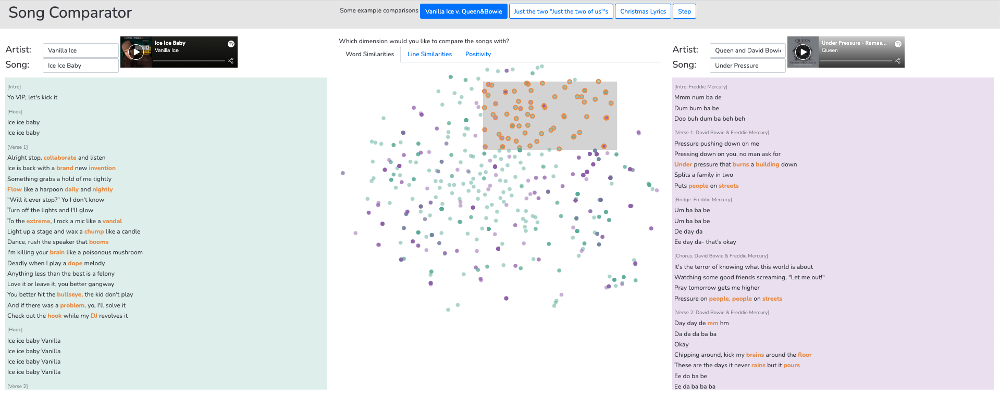

# CMU Interactive Data Science Final Project

* **Title**: Lyric Visualization
* **Track**: Interactive Visualization/Application
* **Team members**:
  * Contact person: Peter Schaldenbrand - pschalde@andrew.cmu.edu
  * Paulina Davison - pldaviso@andrew.cmu.edu

## Abstract
TODO

## Running Locally
Clone the repository and run python3 server.py in the repository folder. There may be libraries that need to be downloaded in order for the application to run.

## Viewing Online
At this time we are not hosting our application online.

## Paper and Video
The paper is in Report.MD in this repository.
The video is available to the instructors on Canvas.

## Work distribution and Project Process
Peter did 65% of the work and Paulina did 35% of the work. In developing the proposal, Peter and Paulina separately brainstormed ideas. They utilized office hours to receive guidance on the idea selection, collaborated in writing the project proposal, and utilized office hours to receive feedback on the proposal write-up. In the proposal there were several data sources that were presented, and some that were recommended in the feedback on the proposal. Paulina lead the development of code to gather features from these sources for the song "Just the Two of Us" by Will Smith, which was used as an example for the Design Review Prototype. Word positivity vs. line positivity and the parts of speech of words in a line were the features that were presented in the Design Review Prototype. In later iterations, Peter added T-Distributed Stochastic Neighbor Embedding (TSNE) for words and lines. In addition, Peter and Paulina added a different view of word positivity vs. line positivity based on a joint decision to treat positivity as a discrete quantity rather than a continuous quantity from the new knowledge that the value returned was a confidence of a machine learning model. Paulina gathered synonyms and antonyms for words using the Merriam-Webster Dictionary API, but after brainstorming how to display these connections, Peter and Paulina decided to focus on other features for the final project. This decision was influenced by the fact that the synonyms and antonyms were grouped based on usage, but there was no clear way to distinguish between different usages of the same word in the lyrics.

In the first discussions of whether to develop using Streamlit, D3.JS, or another structure, Peter and Paulina decided to use D3.JS because they thought that it would provide them a desired flexibility to create some unusual or creative visualizations for their dataset. In addition, they wanted to learn the basics of what many professional data visualizations utilize. Peter lead the development of the code for the web application. He created the interactive techniques of: selecting a word (or later - line) in the song lyrics and having the corresponding point be highlighted in the scatter plot; selecting a point (on click) or points (on brush) in the scatter plot and having the corresponding words be highlighted in the song lyrics; and using the tooltip in the scatter plot to being able to learn which word was associated with the point. In addition, he developed the ability to click on a line and see the part of speech of each word, to view the positivity of the lines as a heat-map next to the lyrics, and to have a fish-eye view of the lyrics so that the current lyric being hovered over would be bigger than the ones around it. Of these techniques used in the Design Review Prototype, the scatter plot interaction was kept for the final project and the positivity heat-map was kept but changed to show discrete values (negative or positive only). For the final project, Peter added the ability to see two songs and have their data mapped to the same scatter plots as well as the functionality for different pairs of example songs and including the Spotify preview for each song. Both Peter and Paulina fixed small bugs that they saw in the application and that impacted the user experience. Paulina lead the development of the Final Project Report. Throughout the entire development process, Peter and Paulina met via zoom meetings to collaborate on the project and discuss the design of the web application.
